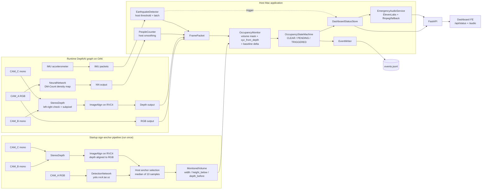

# SeeCure Technical Writeup

## Pipeline Overview

SeeCure is built around one guiding question: is the clearance volume directly ahead of an emergency exit free of obstructions right now?

That question is geometric, not appearance-based. A poster next to an exit may look relevant in RGB, but it does not block egress; a chair, box, or person standing inside the clearance volume does. SeeCure therefore reasons in millimetres against a calibrated 3D volume anchored to the detected emergency-exit sign.

The system is split between the OAK device and the host Mac:

- OAK device: runs DepthAI camera, stereo depth, IMU, and neural network nodes.
- Host Mac: runs `main.py`, sign-anchor orchestration, baseline capture, occupancy logic, state machine, status API, JSONL event writing, audio generation, and the frontend.

The OAK does not receive a persistent deployment. The Python process on the Mac creates DepthAI graphs, starts them on the device, reads frames/NN outputs/IMU packets back from the device, and performs the application-level decisions on the host.

## Startup Sign Detection

The first stage is the emergency-exit sign detector in `exitclear_minimal/sign_detection.py`. It runs once at startup inside a short-lived DepthAI pipeline.

The pipeline uses:

- `CAM_A` RGB as input to a DepthAI `DetectionNetwork`.
- `CAM_B` and `CAM_C` mono cameras as input to `StereoDepth`.
- `ImageAlign` on RVC4/OAK 4 to align depth to RGB.
- The configured local NN archive `yolo.rvc4.tar.xz`.

For each detection whose label matches `sign_detection.target_label` from `config.yaml`, currently `emergency`, the code:

1. Takes the detection bounding box.
2. Uses a centered sub-ROI scaled by `bbox_scale`.
3. Computes median depth in that sub-ROI, restricted to `depth_lower_mm..depth_upper_mm`.
4. Back-projects the detection center through the camera intrinsics.
5. Produces a `SpatialPoint(x_mm, y_mm, z_mm)`.

The detector collects `ANCHOR_SAMPLE_COUNT = 10` valid anchor samples, then takes a per-axis median to produce a stable sign anchor. After this, the sign detection pipeline is stopped. This is intentional: once the camera is fixed and the sign anchor is known, re-running the sign detector every frame would add load without improving the clearance check.

## Monitored Clearance Volume

The sign anchor is converted into a 3D clearance volume by `MonitoredVolume.from_anchor()` in `exitclear_minimal/volume.py`.

The current `config.yaml` uses:

```yaml
monitoring:
  volume_mm:
    width_mm: 2000
    height_below_anchor_mm: 2600
    depth_before_anchor_mm: 1000
```

That means the monitored volume is approximately:

- 2.0 m wide, centered around the anchor X coordinate;
- 2.6 m high, extending downward from the anchor Y coordinate;
- 1.0 m deep, extending from the sign plane toward the camera.

If the detected sign anchor were:

```text
X = 0 mm, Y = 2000 mm, Z = 10000 mm
```

the monitored bounds would be:

```text
X: -1000..1000 mm
Y:  -600..2000 mm
Z:  9000..10000 mm
```

The volume is visualized in the OpenCV preview as a projected 3D cuboid.

## Runtime Depth Pipeline

After startup detection, the steady-state pipeline is created in `exitclear_minimal/oak_depth_source.py`.

It uses a single DepthAI graph with:

- `CAM_A` RGB output.
- `CAM_B` and `CAM_C` mono outputs.
- `StereoDepth` with left-right check enabled.
- Optional subpixel mode from config defaults.
- Configured median filtering, defaulting internally to `KERNEL_7x7`.
- `ImageAlign` on RVC4/OAK 4 to align depth to RGB.
- Optional DM-Count people-counting NN.
- Optional IMU accelerometer stream.

The host reads the OAK calibration and keeps the `CAM_A` intrinsics for the chosen runtime resolution. Each runtime iteration yields a `FramePacket` containing:

- timestamp;
- RGB frame;
- depth frame in millimetres;
- camera intrinsics;
- earthquake trigger fields;
- smoothed people count;
- people density map.

The current default runtime camera settings are hidden from normal YAML tuning and live in `config.py`: `1280x800`, `15 FPS`, `HIGH_DETAIL`, subpixel depth, and `KERNEL_7x7` median filtering unless overridden.

## People Counter

The optional people counter uses a Luxonis model zoo model configured as:

```yaml
people_counter:
  enabled: true
  model_name: luxonis/dm-count:shb-426x240
  tensor_name: density_map
  raw_scale: 242.0
  smoothing_frames: 5
```

The NN node runs in the DepthAI graph. The host-side `PeopleCounter` then:

1. Reads the output tensor named `density_map`.
2. Reshapes it into a 2D density field.
3. Sums the density map.
4. Divides by `raw_scale`.
5. Applies a rolling average over `smoothing_frames`.

The smoothed people count is reported to the dashboard. The density map is also retained for emergency-mode heatmap visualization.

Important: people counting does not gate the backend exit-clearance state machine or JSONL events. It affects dashboard metrics. The frontend may visually promote the global dashboard state if room occupancy approaches or exceeds `room.capacity`, but that is separate from the depth-based exit obstruction state.

## Earthquake Detection

The OAK IMU provides raw accelerometer packets. The host-side `EarthquakeDetector` in `exitclear_minimal/earthquake.py` consumes those packets and computes vibration as:

```text
abs(sqrt(ax^2 + ay^2 + az^2) - 9.81)
```

This removes the gravity component and estimates acceleration caused by vibration. The trigger fires when vibration stays above `threshold_mps2` for at least `min_duration_s`.

The current config is:

```yaml
earthquake:
  enabled: true
  sample_rate_hz: 400
  batch_threshold: 20
  threshold_mps2: 0.98
  min_duration_s: 0.05
```

When earthquake is triggered, `DashboardStatusStore` latches the dashboard state to `emergency`. This latch currently clears only when the backend restarts.

## Baseline And Occupancy Logic

Baseline capture is handled by `BaselineBuilder` in `exitclear_minimal/baseline.py`.

During startup warm-up:

- `baseline_frames` depth frames are collected.
- Invalid/sub-minimum depth values are converted to `NaN`.
- The per-pixel `nanmedian` becomes the empty-scene baseline.

Current config:

```yaml
baseline_frames: 30
```

The actual obstruction reasoning happens in `OccupancyMonitor.evaluate()` in `exitclear_minimal/occupancy.py`.

For each frame:

1. The configured 3D volume is projected into pixel space with `projection_mask()`. This produces a 2D mask of pixels whose viewing rays intersect the volume.
2. The current depth frame is back-projected into `(X, Y, Z)` point coordinates with `xyz_from_depth()`.
3. The current 3D points are intersected with the volume bounds.
4. A pixel is counted as occupied if:

```text
baseline_depth - current_depth > depth_delta_mm
```

and the current 3D point lies inside the monitored volume.

Current config:

```yaml
depth_delta_mm: 150
occupancy_threshold_pct: 7.0
smoothing_frames: 5
```

The denominator is based on the projected volume mask and valid baseline pixels. Occupancy is then smoothed with a rolling average over the last `smoothing_frames` values.

## State Machine

`OccupancyStateMachine` in `exitclear_minimal/state_machine.py` maps smoothed occupancy into four states:

- `NO_BASELINE`: baseline calibration is still running.
- `CLEAR`: occupancy is below threshold.
- `OCCUPIED_PENDING`: occupancy is above threshold but has not persisted long enough.
- `TRIGGERED`: occupancy stayed above threshold for `persistence_threshold_s`.

Current config:

```yaml
persistence_threshold_s: 5.0
```

The persistence timer prevents brief movement through the exit area from immediately becoming a blocked-exit event.

## Events And Status API

State changes are written by `EventWriter` in `exitclear_minimal/events.py`.

Events are appended to the configured JSONL path:

```yaml
output:
  events_path: events.jsonl
```

The writer emits:

- `volume_occupancy_triggered` when entering `TRIGGERED`;
- `volume_occupancy_cleared` when returning to `CLEAR` from `OCCUPIED_PENDING` or `TRIGGERED`.

Each event includes:

- device ID;
- zone ID;
- timestamp;
- state;
- occupancy;
- threshold values;
- projected ROI;
- sign anchor;
- monitored volume dimensions;
- monitored volume bounds.

The latest live state is stored in memory by `DashboardStatusStore` and exposed by FastAPI in `exitclear_minimal/api.py`.

Endpoints:

```text
GET /api/status
GET /health
GET /audio/<filename>
```

`/api/status` returns the latest snapshot for the frontend. It does not read from `events.jsonl`.

## Dashboard State Mapping

Backend state mapping:

- `NO_BASELINE` / `CLEAR` -> dashboard `state: safe`, exit `status: CLEAR`.
- `OCCUPIED_PENDING` -> dashboard `state: caution`, exit `status: OCCUPIED_PENDING`.
- `TRIGGERED` -> dashboard `state: danger`, exit `status: TRIGGERED`.
- earthquake trigger -> dashboard `state: emergency`, with an `evacuation` payload.

The exit identity is derived from the detected sign label. For the current `emergency` label:

```json
{
  "id": "emergency_1",
  "name": "Emergency Exit 1",
  "type": "emergency"
}
```

The frontend also has local room-capacity presentation logic:

- `people.current > room.capacity * 0.9` can visually promote `safe` to `caution`;
- `people.current > room.capacity` can visually promote to `danger`.

Metric colors are independent. For example, a clear exit remains green even if the global dashboard state is alert due to crowding.

## Emergency Audio

Emergency audio generation is handled by `EmergencyAudioService` in `exitclear_minimal/audio.py`.

When earthquake evacuation is triggered:

1. The backend asks ElevenLabs to generate a voice file if `ELEVENLABS_API_KEY` is available.
2. If `ffmpeg` is available, the backend composes alarm + voice into one MP3 loop.
3. If composition is not available, the API returns `audioSequence` and `audioPauseMs`.
4. If ElevenLabs credentials are missing and no cached voice exists, the backend still exposes an alarm-only fallback sequence.

Current config:

```yaml
audio:
  enabled: true
  output_dir: generated_audio
  alarm_path: assets/alarm.mp3
  repeat_count: 3
  pause_ms: 650
  voice_id: JBFqnCBsd6RMkjVDRZzb
  model_id: eleven_multilingual_v2
  output_format: mp3_44100_128
```

The frontend attempts playback automatically when `EVACUATE` arrives. Browser autoplay policies may still block fully unattended audio unless the page has already received a click/key interaction or the browser is launched with autoplay allowed.

## Mermaid Diagram



## Emergency-Exit Detector Fine-Tuning

The runtime code expects a local Luxonis NN archive at:

```text
yolo.rvc4.tar.xz
```

That archive is loaded with:

```python
dai.NNArchive(str(model_path))
```

The training/fine-tuning process is external to this repository runtime. The current project assumes the model has already been trained/exported into a DepthAI-compatible archive.

If documenting the training workflow, keep the distinction clear:

- Training/fine-tuning happens off-device, for example in Google Colab.
- Runtime inference happens in a DepthAI `DetectionNetwork` node on the OAK.
- Host Python consumes detections and depth, then computes the spatial anchor.

## Runtime Notes

- The app is launched on the Mac with `python main.py`.
- The OAK must be connected and visible to DepthAI.
- The sign detector model archive must exist or be passed with `--model`.
- The monitored clearance volume must be empty during baseline capture.
- If people or objects are inside the volume during baseline, they may be learned as background.
- People counting is approximate and depends on `people_counter.raw_scale`.
- Earthquake evacuation is latched until backend restart.
- OpenCV preview can be disabled with `output.live_view: false` if needed.

## Key Code Locations

- Main loop: `main.py`
- Config loading: `exitclear_minimal/config.py`
- Sign detection: `exitclear_minimal/sign_detection.py`
- Runtime OAK source: `exitclear_minimal/oak_depth_source.py`
- Volume geometry: `exitclear_minimal/volume.py`
- Occupancy: `exitclear_minimal/occupancy.py`
- State machine: `exitclear_minimal/state_machine.py`
- Status API: `exitclear_minimal/api.py`
- Dashboard snapshot: `exitclear_minimal/status_store.py`
- Event writer: `exitclear_minimal/events.py`
- Audio generation: `exitclear_minimal/audio.py`
